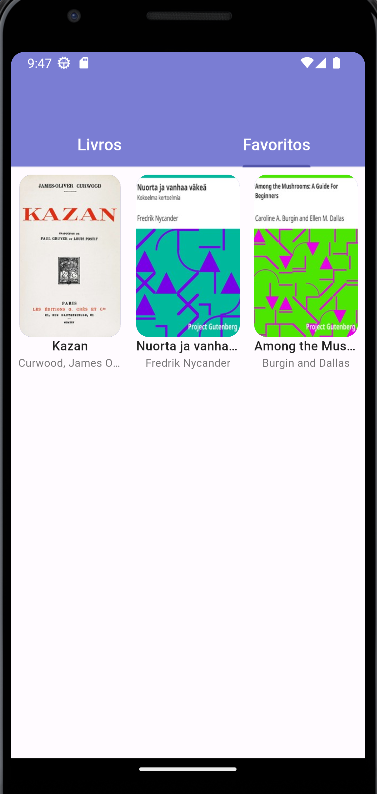

# 🚀 Book Reader

O projeto consiste em uma aplicação que realiza uma chamadas a uma API externa que retorna uma lista de livros, estes que serão exibidos na tela do usuário de maneira intuitiva, semelhante a uma estante de livros. O app também permite marcar seus livros como favoritos, onde possui uma aba dedicada de favoritos apenas com seus livros marcados. Também é possível realizar o download de um livro ao tocar em sua capa, onde o arquivo ficará salvo em um diretório no dispositivo do usuário. Ao mesmo tempo que o download é realizado é aberto um visualizador intuitivo onde você pode realizar a leitura dos seus livros.  

## 📱 Screenshots

| Tela principal                | Tela com favoritos   | Tela apenas com favoritos                    | Tela de leitura                  |
|:----------------------------:|:--------------------------------:|:-----------------------------:|:-------------------------------:|
|  |  |  |  |


## ✨ Funcionalidades

- Visualização atualizada de livros e suas respectivas capas.
- Download e armazenamento de livros no dispositivo do usuário.
- Visualização do conteúdo do livro através de um leitor intuitivo.
- Botão de favoritar um livro.
- visualição apenas dos livros marcados como favoritos pelo usuário.

## 💻 Como Executar o projeto

⚠️ Certifique-se de ter o ambiente Dart instalado em seu sistema. Você pode baixá-lo em [dart.dev](https://dart.dev/get-dart).

⚠️ Certifique-se de ter o ambiente Flutter instalado em seu sistema. Você pode baixá-lo em [Flutter.dev](https://docs.flutter.dev/get-started/install).

_Clone o repositório_
```bash
git clone git@github.com:Brennez/Desafio-Tecnico-2.git
```
_Entre na pasta do projeto_
```bash
cd Desafio-Tecnico-2
```
_Baixe as depedências do projeto_
```bash
flutter pub get
```
_Execute o comando para instalar o aplicativo_
```bash
flutter install
```

## 💻 Como instalar o aplicativo
- Entre na pasta [releases](releases) em seguida faça o download do arquivo `.apk` em seguida faça a instalação no seu dispositivo

📍 Lembre-se de que para realização da instalação é necessário permitir a instalação de fontes desconhecidas no seu dispositivo, você pode saber mais sobre esse tópico [aqui](https://support.google.com/googleplay/answer/2812853?hl=pt). 

📍 Alguns dispositivos, é necessário desabilitar o Google Play protect, uma vez que a mesma bloqueia a instalação de apps de fora da loja de aplicativos. Mas fique tranquilo, o app é totalmente seguro, possuindo apenas objetivos educacionais. Você pode saber mais sobre como desativar a Google Play protect [aqui](https://medium.com/@duytq94/fixing-app-not-installed-on-android-devices-when-installing-from-apk-762ce6019c77).

## ⬇️ Área de downloads
- Você pode baixar o app na pasta [releases](releases) no repositório.
- Você também pode baixar o app clicando em `releases` no canto direito deste repositório.

## ⚠️ Informações úteis
- O livro é após ser baixado encontra-se no diretório: `Android/data/com.example.book_reader/files/` 

- Por melhor do meu conhecimento, a implementação do botão de retorno à tela principal após a abertura da tela de leitura se mostrou inviável ao utilizar o pacote `Vocsy Epub Viewer`. Uma issue foi aberta para discutir essa questão no repositório do pacote, e você pode encontrá-la no seguinte link: [Issue](https://github.com/kaushikgodhani/vocsy_epub_viewer/issues/44).

## ✨ Tecnologias Utilizadas

[](https://flutter.dev/)
[](https://dart.dev/)
[](https://pub.dev/packages/flutter_mobx)


# 💙 Contato

[](https://www.linkedin.com/in/tchalisson-brenne-27911421b/)
[](https://github.com/Brennez)
[](mailto:tchalisantos40@gmail.com)


